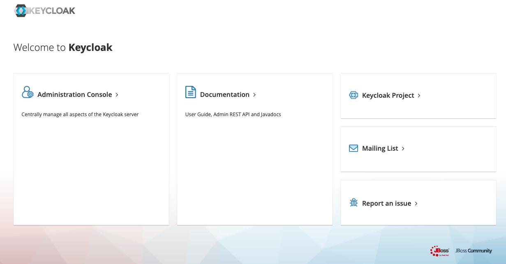
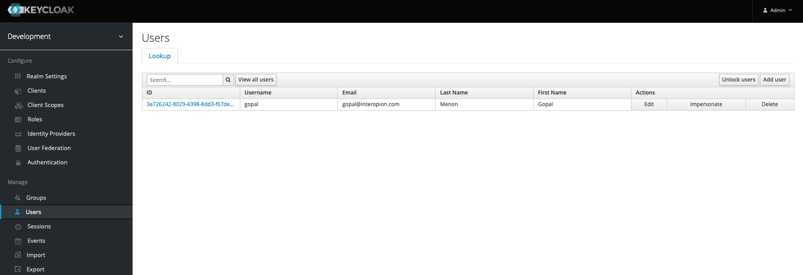
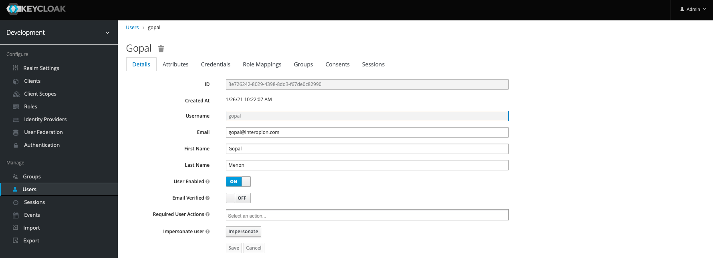

# Keycloak Server with MySQL database
This is a repository for running a local keycloak server with MySQL used for persistence. The realm properties sample file can be replaced with another one as needed. Or a different realm can be imported through the application after it has been started.

## Download and Install
1. Clone the project
```
git clone https://github.com/gopalinteropion/keycloak-server-with-mysql.git
```
2. Change to the new directory
```
cd keycloak-server-with-mysql
```
## Starting the application
Make sure you do not have any conflicts on ports `3306` or `8080`. In the same terminal session or another one, go to the folder for the repository and run the command:
```
docker-compose up
``` 
## Checking the status of the application
Go to the folder for the repository and run the command:
```
docker-compose ps
```
You should see something like what is shown below, showing that the keycloak and MySQL containers are running
```
                Name                               Command               State                 Ports              
------------------------------------------------------------------------------------------------------------------
keycloak-server-with-mysql_keycloak_1   /opt/jboss/tools/docker-en ...   Up      0.0.0.0:8080->8080/tcp, 8443/tcp 
keycloak-server-with-mysql_mysql_1      docker-entrypoint.sh mysqld      Up      0.0.0.0:3306->3306/tcp, 33060/tcp
```
## Stopping the application
Go to the folder for the repository and run the command:
```
docker-compose stop
``` 
## Using keycloak
To login as an administrator, go to http://localhost:8080 on a browser, and you will see the following screen.

Click on Administration Console and login with user `admin` and password `admin`. 
Now click on Users and View all users. You can create a new user and see existing users. 


Click on the ID of your user, and you will be able to see the additional user details.
